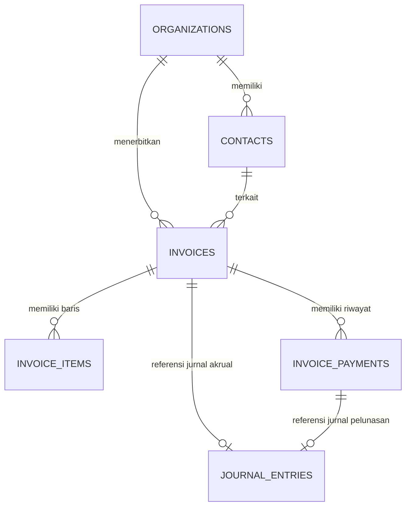

# System Design Spec: Smart Invoicing, Contacts Directory, & AR/AP Management (Milestone 2.1)

## 1. Ringkasan Eksekutif & Tujuan

Milestone 2.1 (bagian dari Sub-Proyek 2: Complete Financial Workflows) mengimplementasikan modul **Faktur & Tagihan (Invoicing & Bills)**, **Buku Direktori Kontak (Pelanggan & Pemasok)**, dan **Analisis Umur Piutang/Utang (Aging AR/AP)**.

Sistem menggabungkan antarmuka visual berbasis web (*Paper & Ink Matte UI*) dan kemampuan agen percakapan (*Nara AI*) sehingga pengguna dapat mengelola penagihan, pelunasan bertahap, pembuatan invoice, dan follow-up WhatsApp secara fleksibel.

---

## 2. Arsitektur Data & Model Skema (*Unified Commercial Document Model*)

Menggunakan skema terpadu di Drizzle ORM (`src/server/db/schema/invoicing.ts`):

### 2.1. Tabel `contacts`
- `id`: `uuid` PK default `gen_random_uuid()`
- `org_id`: `uuid` FK `organizations.id` (Indexed, RLS-enabled)
- `type`: `text` enum `'CUSTOMER' | 'VENDOR' | 'BOTH'`
- `name`: `varchar(255)` NOT NULL
- `email`: `varchar(255)` NULL
- `phone`: `varchar(50)` NULL (Nomor WhatsApp/HP)
- `address`: `text` NULL
- `tax_id`: `varchar(50)` NULL (NPWP jika ada)
- `payment_terms_days`: `integer` NOT NULL DEFAULT 30 (Termin pembayaran default)
- `notes`: `text` NULL
- `created_at`, `updated_at`: `timestamp with time zone`

### 2.2. Tabel `invoices`
- `id`: `uuid` PK default `gen_random_uuid()`
- `org_id`: `uuid` FK `organizations.id` (Indexed, RLS-enabled)
- `type`: `text` enum `'INVOICE' | 'BILL'` NOT NULL (`INVOICE` = Piutang Penjualan, `BILL` = Utang Pembelian)
- `invoice_number`: `varchar(50)` NOT NULL (contoh: `INV-2026-0001` atau `BILL-2026-0001`)
- `contact_id`: `uuid` FK `contacts.id` NOT NULL
- `issue_date`: `date` NOT NULL (Tanggal faktur)
- `due_date`: `date` NOT NULL (Tanggal jatuh tempo)
- `currency`: `varchar(3)` NOT NULL DEFAULT `'IDR'`
- `subtotal_minor`: `numeric(18, 0)` NOT NULL DEFAULT 0 (Minor units, BigInt)
- `discount_minor`: `numeric(18, 0)` NOT NULL DEFAULT 0
- `tax_minor`: `numeric(18, 0)` NOT NULL DEFAULT 0 (Nilai PPN)
- `total_minor`: `numeric(18, 0)` NOT NULL DEFAULT 0 (Subtotal - Diskon + Pajak)
- `amount_paid_minor`: `numeric(18, 0)` NOT NULL DEFAULT 0 (Akumulasi pembayaran yang telah diterima/dibayar)
- `status`: `text` enum `'DRAFT' | 'ISSUED' | 'PARTIALLY_PAID' | 'PAID' | 'OVERDUE' | 'VOID'` NOT NULL DEFAULT `'DRAFT'`
- `journal_entry_id`: `uuid` FK `journal_entries.id` NULL (Terkait saat faktur diposting ke jurnal akrual)
- `notes`: `text` NULL (Catatan / Syarat pembayaran / Rekening tujuan)
- `created_at`, `updated_at`: `timestamp with time zone`

### 2.3. Tabel `invoice_items`
- `id`: `uuid` PK default `gen_random_uuid()`
- `invoice_id`: `uuid` FK `invoices.id` ON DELETE CASCADE NOT NULL
- `description`: `text` NOT NULL (Deskripsi barang/jasa)
- `quantity`: `numeric(12, 2)` NOT NULL DEFAULT 1
- `unit_price_minor`: `numeric(18, 0)` NOT NULL DEFAULT 0
- `discount_minor`: `numeric(18, 0)` NOT NULL DEFAULT 0
- `tax_rate_percent`: `numeric(5, 2)` NOT NULL DEFAULT 0 (0, 11, 12, dll)
- `total_minor`: `numeric(18, 0)` NOT NULL DEFAULT 0

### 2.4. Tabel `invoice_payments`
- `id`: `uuid` PK default `gen_random_uuid()`
- `invoice_id`: `uuid` FK `invoices.id` ON DELETE CASCADE NOT NULL
- `payment_date`: `date` NOT NULL
- `amount_minor`: `numeric(18, 0)` NOT NULL (Jumlah yang dibayarkan pada transaksi ini)
- `payment_account_id`: `uuid` FK `accounts.id` NOT NULL (Kas `1110` atau Bank `1120`)
- `reference_number`: `varchar(100)` NULL (Nomor bukti transfer/referensi bank)
- `journal_entry_id`: `uuid` FK `journal_entries.id` NULL (Jurnal pelunasan kas terkait)
- `notes`: `text` NULL
- `created_at`: `timestamp with time zone`

---

## 3. Integrasi Double-Entry Ledger (Akuntansi Pembukuan)

Sesuai preferensi **Opsi 2 (Semi-Manual / Controlled Posting)**:

### 3.1. Pembuatan Dokumen Awal
Faktur dibuat sebagai dokumen komersial dengan status `DRAFT` atau `ISSUED`. Angka belum mempengaruhi neraca atau laba-rugi buku besar sampai pengguna menekan tombol **"Posting ke Jurnal"** atau mengonfirmasi aksi di Nara AI.

### 3.2. Posting Faktur Penjualan (`INVOICE` - Piutang)
Menghasilkan Jurnal Umum (`journal_entries` + `journal_lines`):
- **Debit**: `1200 Piutang Usaha` sebesar `total_minor`
- **Kredit**: `4100 Pendapatan Usaha` sebesar `subtotal_minor - discount_minor`
- **Kredit**: `2200 PPN Keluaran` sebesar `tax_minor` (jika tarif pajak > 0)
- `invoices.journal_entry_id` dihubungkan ke ID entri jurnal ini.

### 3.3. Posting Tagihan Pembelian (`BILL` - Utang)
- **Debit**: `5100 Beban Pokok Penjualan` (atau beban utilitas/lain) sebesar `subtotal_minor - discount_minor`
- **Debit**: `1400 PPN Masukan` sebesar `tax_minor` (jika ada)
- **Kredit**: `2100 Utang Usaha` sebesar `total_minor`
- `invoices.journal_entry_id` dihubungkan ke entri jurnal ini.

### 3.4. Pelunasan Pembayaran (`invoice_payments`)
Saat pembayaran dicatat (bisa lunas langsung atau bertahap/parsial):
- **Faktur Penjualan**:
  - **Debit**: Kas (`1110`) atau Bank (`1120`) sebesar `amount_minor`
  - **Kredit**: `1200 Piutang Usaha` sebesar `amount_minor`
- **Tagihan Pembelian**:
  - **Debit**: `2100 Utang Usaha` sebesar `amount_minor`
  - **Kredit**: Kas (`1110`) atau Bank (`1120`) sebesar `amount_minor`
- Nilai `amount_paid_minor` di-update:
  - Jika `amount_paid_minor >= total_minor` -> status = `PAID`.
  - Jika `amount_paid_minor > 0` dan `< total_minor` -> status = `PARTIALLY_PAID`.

---

## 4. Antarmuka Pengguna (User Interface)

Desain mengikuti prinsip token *Paper & Ink Matte* (`canvas`, `paper`, `ink`, `terra`, `elevation`, `gutter`):

### 4.1. Halaman Direktori Kontak (`/kontak`)
- **Header**: Judul "Buku Kontak", tombol "+ Tambah Kontak Baru", filter tab (Semua, Pelanggan, Pemasok).
- **Tabel Kontak**: Kolom Nama Kontak, Tipe (Badge), No WhatsApp / Telepon, Email, Total Saldo Piutang/Utang Aktif, Aksi (Edit, Detail).
- **Dialog Tambah/Edit Kontak**: Input Nama, Tipe, Telepon/WA, Email, Alamat, Termin Pembayaran default (hari), NPWP.
- **Drawer / Sheet Profil Kontak**: Menampilkan ringkasan informasi kontak beserta riwayat seluruh faktur yang pernah diterbitkan untuk mereka.

### 4.2. Halaman Faktur & Tagihan (`/faktur`)
- **Navigasi Tab**:
  1. **Tab 1: Piutang (Faktur Penjualan)**:
     - Kartu KPI ringkas: Total Piutang Beredar, Sudah Jatuh Tempo (*Overdue*), Diterima Bulan Ini.
     - Tabel Faktur Penjualan: Nomor Faktur, Pelanggan, Tanggal Terbit, Jatuh Tempo, Status Badge (`DRAFT`, `ISSUED`, `PARTIALLY_PAID`, `PAID`, `OVERDUE`), Sisa Tagihan.
     - Baris Aksi Cepat:
       - Tombol **"Cetak / Lihat"**: Membuka tampilan detail invoice.
       - Tombol **"Posting Jurnal"**: Jika belum terposting (`journal_entry_id == null`).
       - Tombol **"Catat Pembayaran"**: Dialog input jumlah, tanggal, dan akun kas/bank.
       - Tombol **"WhatsApp Reminder"**: Membuka WhatsApp Web/App dengan pesan tagihan yang sudah disiapkan.
  2. **Tab 2: Utang (Tagihan Pembelian)**:
     - Kartu KPI: Total Utang Usaha, Tagihan Jatuh Tempo Minggu Ini.
     - Tabel Tagihan Vendor: Nomor Tagihan, Pemasok, Tanggal, Jatuh Tempo, Status, Tombol Catat Bayar & Posting Jurnal.
  3. **Tab 3: Analisis Umur Piutang & Utang (Aging Summary)**:
     - Visualisasi kategori umur:
       - *Belum Jatuh Tempo (Lancar / Current)*
       - *1 - 30 Hari*
       - *31 - 60 Hari*
       - *> 60 Hari (Perhatian Khusus)*
     - Tabel rincian per pelanggan/vendor untuk memudahkan prioritas penagihan.

### 4.3. Halaman Detail & Pratinjau Cetak Faktur (`/faktur/[id]`)
- Tampilan dokumen invoice bergaya *Paper & Ink* profesional:
  - Header: Nama Organisasi/Usaha, Nomor Faktur, Tanggal, Status Stamp.
  - Detail Penerima / Pelanggan (Nama, Alamat, Telepon).
  - Tabel Rincian Item (Deskripsi, Jumlah, Harga Satuan, Diskon, PPN, Subtotal).
  - Ringkasan Total (Subtotal, Diskon, PPN, Total Tagihan, Terbayar, Sisa Tagihan).
  - Kotak Informasi Pembayaran (Instruksi Transfer Bank & Nomor Rekening).
  - Tombol Aksi: Cetak / Simpan PDF (`window.print()`), Salin Tautan, Kirim WhatsApp.

---

## 5. Integrasi Agen AI Nara

Menambahkan tool-tool baru di `src/server/ai/nara-tools.ts`:

### 5.1. Tool `create_invoice`
- **Tipe**: `MUTATING_TOOLS` (Membutuhkan konfirmasi Smart HITL jika belum berizin penuh).
- **Fungsi**: Membuat dokumen faktur penjualan atau tagihan pembelian melalui instruksi natural language (misal: *"Buatkan invoice ke Pak Budi (0812345678): 5 rim kertas @ 50rb, jatuh tempo 14 hari"*).
- **Otomasi Cerdas**: Jika kontak belum terdaftar di tabel `contacts`, secara otomatis membuat kontak baru.

### 5.2. Tool `record_invoice_payment`
- **Tipe**: `MUTATING_TOOLS`.
- **Fungsi**: Mencatat penerimaan uang atau pembayaran tagihan berdasarkan nomor faktur atau nama kontak.
- **Otomasi**: Otomatis memperbarui `amount_paid_minor`, menghitung sisa tagihan, dan mengubah status menjadi `PAID` atau `PARTIALLY_PAID`.

### 5.3. Tool `get_ar_ap_aging`
- **Tipe**: `SAFE_TOOLS` (Auto-execute).
- **Fungsi**: Menghitung ringkasan umur piutang (*Aging Receivables*) dan utang (*Aging Payables*), mendeteksi invoice mana yang mendekati atau telah melewati jatuh tempo, dan memberikan saran chips tindakan.

### 5.4. Tool `generate_whatsapp_reminder`
- **Tipe**: `SAFE_TOOLS`.
- **Fungsi**: Membentuk pesan WhatsApp yang sopan, profesional, dan menyertakan rincian sisa tagihan beserta rekening transfer, dilengkapi tautan langsung `wa.me`.

---

## 6. Rencana Verifikasi & Uji Otomatis

1. **Unit Tests (`tests/unit/invoicing/*.test.ts`)**:
   - Perhitungan diskon, tarif PPN 11%/12%, dan total faktur dalam minor units.
   - Perhitungan status faktur (parsial vs lunas vs jatuh tempo).
   - Generasi pesan WhatsApp pengingat.
2. **Integration Tests (`tests/integration/invoicing-flow.test.ts`)**:
   - Alur CRUD kontak.
   - Pembuatan invoice, posting jurnal akrual, pelunasan bertahap, dan pembuatan jurnal kas.
   - Eksekusi tool AI Nara `create_invoice`, `record_invoice_payment`, dan `get_ar_ap_aging`.
3. **Build & Type Check**:
   - `bunx tsc --noEmit` wajib hijau (0 error).
   - `bun run test` seluruh 48+ test suite wajib lolos.
   - `bun run build` sukses kompilasi halaman `/kontak`, `/faktur`, dan `/faktur/[id]`.
